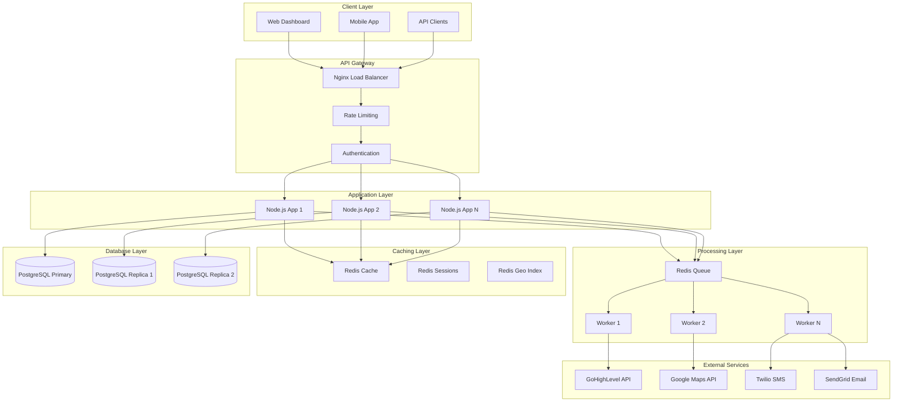
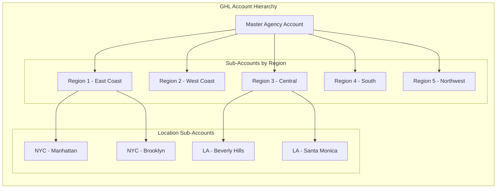
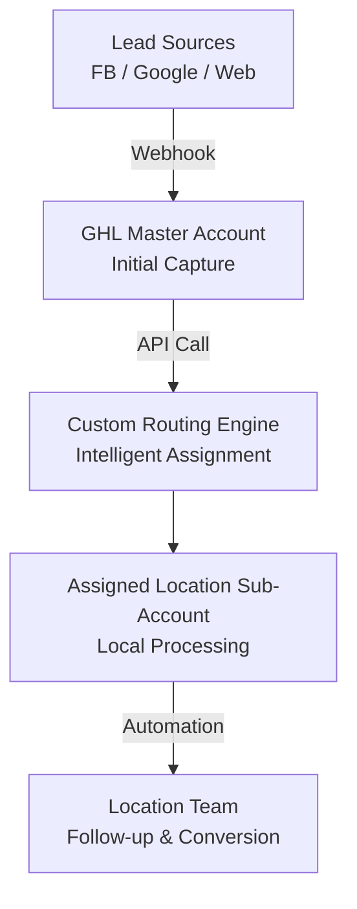

# Part 1: Technical Architecture

## Architectural Diagrams

### High-Level Architecture

### GHL Structure Overview

## A. System Architecture Overview

### GHL Structure Design

**Master Account Hierarchy:**

- **Agency Master Account**: Central control and lead distribution hub
- **Regional Sub-Accounts**: Group locations by geographic regions (East Coast, West Coast, Central, South, Northwest)
- **Location Sub-Accounts**: Individual gym locations with customized automations and pipelines

**Rationale**: This three-tier structure allows for regional management while maintaining individual location autonomy. Regional sub-accounts can handle area-specific promotions while location sub-accounts manage day-to-day operations.

### Custom Developments Required

1. **External Routing Engine**: Node.js API with PostgreSQL database to handle intelligent lead routing beyond GHL's native capabilities
2. **Capacity Management System**: Real-time tracking of location capacity with Redis caching for sub-second response times
3. **Analytics Dashboard**: Custom dashboard aggregating performance data across all locations with role-based access
4. **Webhook Processing Service**: Centralized webhook handler for real-time lead processing and routing decisions

### Data Flow Architecture

**Key Decision**: Use GHL for lead capture and follow-up automation, but route intelligence through custom backend. This leverages GHL's strengths while adding sophisticated routing logic it cannot handle natively.

## B. Code Sample: Intelligent Lead Routing Function

**Choice**: Custom JavaScript function for GHL custom code action that intelligently routes leads based on location, lead score, and capacity.

- [View Here](../src/services/routing.service.js)

**Implementation Notes:**

- This code runs in GHL's Custom Code Action within the master account automation
- It makes API calls to our external routing service for intelligent decisions
- Includes comprehensive error handling and fallback mechanisms
- Provides detailed logging for performance analysis and optimization

## C. Automation Workflow: Facebook Ad Lead Processing

### Complete Lead Processing Flow

**Trigger**: Facebook lead form submission via GHL Facebook integration

**Step-by-Step Workflow:**

1. **Lead Capture** (GHL Native)

   - Facebook webhook delivers lead to GHL master account
   - Contact created with source tagged as "facebook"
   - Lead enters master funnel pipeline
2. **Data Enrichment** (Custom Code Action)

   - Extract and validate zip code from lead data
   - Geocode address if zip code missing or invalid
   - Calculate initial lead score based on form responses
3. **Intelligent Routing** (Custom Code Action - Above Function)

   - Call external routing API with lead data
   - Find closest 3 locations within service radius
   - Check capacity at each location in priority order
   - Assign to optimal location or fallback to overflow
4. **Location Assignment** (GHL Native + Custom)

   - Transfer contact to assigned location sub-account
   - Add to location-specific pipeline
   - Update custom fields with routing information
5. **Team Notification** (GHL Native)

   - Send SMS to assigned location team
   - Create task for immediate follow-up
   - Log notification in activity timeline
6. **Welcome Sequence** (GHL Automation)

   - Trigger location-specific welcome automation
   - Send personalized welcome email with gym details
   - Schedule follow-up SMS for appointment booking
7. **Capacity Update** (Webhook to External API)

   - Update location capacity in external system
   - Trigger capacity alerts if threshold reached
   - Update routing rules if location becomes unavailable

### Edge Case Handling

**Invalid Zip Code:**

- Attempt address geocoding
- If geocoding fails, assign to regional default location
- Flag for manual review

**No Available Capacity:**

- Check secondary and tertiary locations
- If all locations full, add to overflow queue
- Notify franchise owner of capacity issues
- Set up waitlist automation

**API Failures:**

- Immediate fallback to default location
- Log error for investigation
- Continue with standard automation flow
- Admin alert for system issues

**Duplicate Leads:**

- Check for existing contact by phone/email
- If duplicate found, update existing record
- Maintain lead source attribution
- Avoid duplicate follow-up sequences

### Performance Monitoring

- **Routing Response Time**: Target <500ms for routing decision
- **Assignment Success Rate**: Track percentage of successful assignments
- **Capacity Utilization**: Monitor location capacity in real-time
- **Conversion Tracking**: Measure conversion rates by routing method

### Business Rules Configuration

- **Service Radius**: Configurable maximum distance for lead assignment
- **Capacity Thresholds**: Customizable capacity limits per location
- **Priority Scoring**: Weighted factors for location selection
- **Blackout Periods**: Handle location closures and maintenance

This automation workflow ensures every Facebook lead is intelligently routed to the optimal location while maintaining data integrity and providing comprehensive fallback mechanisms for edge cases.

---
